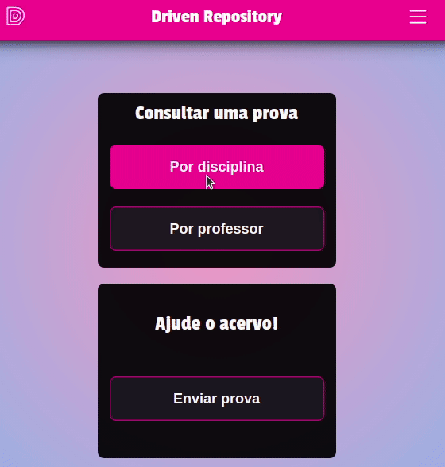

# Exam drive :memo:
A helpful tool to get exams and useful material of past years :mortar_board:
## Preview 👀
 
#### [Click here and try it now!](https://project-repo-provas-front-end.vercel.app/)
## About 🔎
This is an web aplication wich students can share their old tests and find the one they need.
### Implemented features :heavy_check_mark:
- [x] Subjects tests
- [x] Professors tests
- [x] Submit a test
- [x] Order tests by its category
- [x] Open a test 
- [x] Mission page 
- [x] Mobile version
### Future improvements 🔮
- [ ] Sign up
- [ ] Log in
- [ ] Register a professor/subject
- [ ] Delete tests
- [ ] Add college info
## Tech tools 🔧
The following tools and frameworks were used in the construction of the project:<br>
<p>
  
  
  
  
  
</p>

## How to run ⚙️

1. Clone this repository
2. Clone the [back-end repository](https://github.com/jotabraga/examdrive-backend)
3. Follow instructions to run [back-end](https://github.com/jotabraga/examdrive-backend)
4. Install dependencies
```bash
npm i
```
5. Run the front-end with
```bash
npm start
```
6. You can optionally build the project running
```bash
npm run build
```
7. Finally access http://localhost:3000 on your favorite browser 
